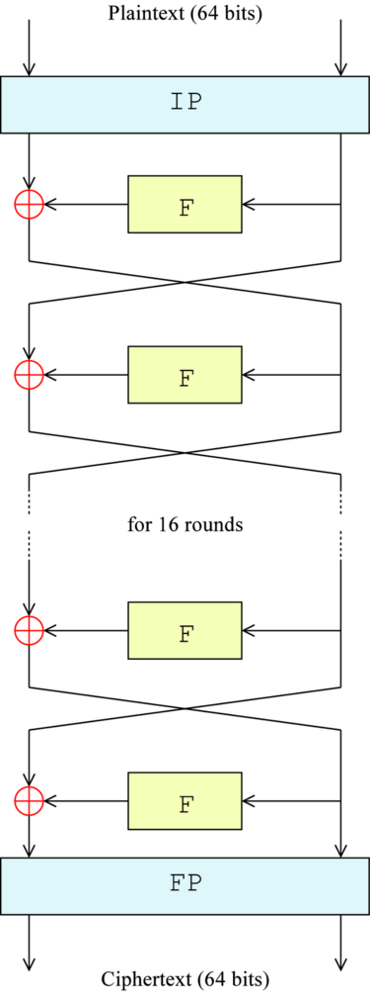
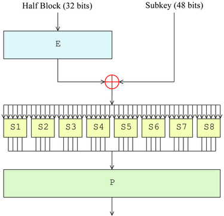

# DES-Implementation


---

## 算法原理概述

- DES算法是一种对称加密算法，输入64位的明文和64位的密钥，可得到64位的密文，同时DES提供对称的解密方法，可通过同一密钥将密文还原为明文。

- 算法过程
    0. 用密钥生成16个子密钥
    1. 对明文进行初始置换
    2. 进行16轮的Feistel函数
    3. W置换：交换最低32位和最高32位
    4. 对明文进行最终置换并输出

在我的代码中有展示这一步骤划分：

```c
/* Encryption
 * input : 64-bit key, 64-bit plainText
 * output: 64-bit cipherText
 */
uint64 encryption(uint64 key, uint64 plainText)
{
    // 0.generate subkeys 
    uint64 *subkeySet = (uint64 *) malloc(17 * sizeof(uint64));
    genSubKeys(key, subkeySet);

    // 1.IP perm -> L0R0(64-bit)
    uint64 L0R0 = initPerm(plainText);
    uint64 L[17], R[17];

    L[0] = L0R0 >> 32;
    R[0] = (L0R0 << 32) >> 32;

    // 2.Feistel rounds -> L16R16
    for(int i = 1; i <= 16; i++)
    {
        L[i] = R[i-1];
        R[i] = L[i-1] ^ Feistel(R[i-1], subkeySet[i]);
    }

    // 3.Exchange Perm
    R[16] = R[16] << 32;
    uint64 ciphertext = R[16] | L[16];

    // 4.IP-1 perm
    ciphertext = finalPerm(ciphertext);

    return ciphertext;
}

```

而解密过程则与加密过程大体相同，只是在调用Feistel轮函数时调用子密钥的顺序反过来即可。

----

## 总体结构

- DES算法总体结构：(此处省略了W置换)

    

- 生成子密钥的调度结构

    

- Feistel函数的结构

    

----

## 数据结构设计

为了最大程度的精简数据结构，选择了使用c的 unsigned long long表示一个64位的块。将其重命名为uint64。

```c
typedef unsigned long long uint64;
```

- 在64位的密钥、明文、密文中，会用到uint64的全部位
- 在48位、32位、16位的中间数据结构中，只会用到uint64的有效低位

与之对应，所有的置换、移位等操作都通过位运算进行，这也有效地减少了算法运行时间。例如，以下是本项目中通用的置换函数。

```c
/* General Permutation function
 * input : input block
 * table : table
 * fromN : number of bits before permutation
 * toN   : number of bits after permutation
 * [____|1,2,...,fromN] -> [___|1,2,...,toN] 
 */ 
uint64 perm(uint64 input, short table[], int fromN, int toN)
{
    uint64 ret = 0;
    for(int i = 0; i < toN; i++)
    {
        uint64 t = (input >> (fromN - table[i]) & 1);
        t = t << (toN - 1 - i);
        ret = ret | t;
    }
    return ret;
}
```

----

## 模块分解

算法依赖的模块在 modules.c, toolFunc.c, tables.c中，
- tables.c 中以全局变量的形式给出了所有需要用到的表格的数据。
- toolFunc.c 中给出了一个通用的置换函数和一些测试函数。
- modules.c 中实现了算法直接依赖的各个模块。
    - 各种置换函数
        - 初始IP置换：initPerm(uint64)
        - IP的逆置换：finalPerm(uint64)
        - E-扩展(32->48)：E_extension(uint64)
        - 子密钥生成中的PC1置换：PC1_perm(uint64)
        - 子密钥生成中的PC2置换：PC2_perm(uint64)
        - Feistel函数中的P置换：p_perm(uint64)
    - **生成子密钥函数**：genSubKeys(uint64, uint64*)
    - **Feistel函数**：Feistel(uint64, uint64)
    - 加密函数：encryption(uint64, uint64)
    - 解密函数：decryption(uint64, uint64)

----

## 关键C语言源代码

与报告同时提交的有源代码文件，故此处只粘上关键的实现。

### 子密钥生成

```c
/* generate subkeys
 * input : 64-bit key, array of subkeys
 * output: nothing but subkeys are writen
 */ 
void genSubKeys(uint64 K, uint64 *subkeys)
{   
    uint64 C0D0 = PC1_perm(K);
    uint64 C[17], D[17];

    D[0] = (C0D0 << 36) >> 36;
    C[0] = C0D0 >> 28 ;

    for(int i = 1; i <= 16; i++)
    {
        if(i == 1 || i == 2 || i == 9 || i == 16)
        {
            // left cyclic shift 1 bit

            // record the highest bit
            uint64 tc = C[i-1] >> 27;
            // left shift 1 bit
            C[i] = C[i-1] << 1;
            // cp highest bit to lowest bit
            C[i] = C[i] | tc;
            // cut the 29th bit
            C[i] = (C[i] << 36) >> 36;

            // the same 
            uint64 td = D[i-1] >> 27;
            D[i] = D[i-1] << 1;
            D[i] = D[i] | td;
            D[i] = (D[i] << 36) >> 36;
        }
        else
        {
            // left cyclic shift 2 bits

            // record the highest 2 bits
            uint64 tc = C[i-1] >> 26;
            // left shift 2 bits
            C[i] = C[i-1] << 2;
            // cp highest 2 bits to lowest 2 bits
            C[i] = C[i] | tc;
            // cut the 29th and 30th bits
            C[i] = (C[i] << 36) >> 36;

            //the same
            uint64 td = D[i-1] >> 26;
            D[i] = D[i-1] << 2;
            D[i] = D[i] | td;
            D[i] = (D[i] << 36) >> 36;
        }
        
        uint64 concat = (C[i] << 28) | D[i];
        subkeys[i] = PC2_perm(concat);
        
        
    }
}
```

### Feistel 函数

```c
/* Feistel round function
 * input : a 32-bit text and a 48-bit subkey
 * output: a 32-bit text
 */ 
uint64 Feistel(uint64 text, uint64 subkey)
{
    // 1. E-extension -> 48 bits
    text = E_expansion(text);

    // 2. Do Xor
    text = text ^ subkey;

    // 3. S-box transform -> afterS
    uint64 afterS = 0;
    for(int i = 0; i < 8; i++)
    {
        // take the lowest 6 bits
        uint64 t = (text << 58) >> 58;
        
        // x = t1t6
        uint64 x = (t >> 5) << 1 | (t & 1); 
        
        // y = t2t3t4t5
        uint64 y = t << 59 >> 59 >> 1;

        uint64 sOut = S_box[7 - i][x][y];
        sOut = sOut << (4 * i);
        afterS = afterS | sOut;

        text = text >> 6;
    }

    // 4. P-Perm
    uint64 res = P_perm(afterS);
    return res;
}
```

----

## 测试方法

在 tests.c中写了两个测试函数

- randomTest() : 生成20组随机的明文和密文的测例，每组做一次加密和解密，并比较解密后是否能得到与原来一样的明文。

- customTest() : 自行输入明文和密文，做一次加密和解密，并比较解密后是否能得到与原来一样的明文。

```c
// test random for 20 times
void randomTest()
{
    printf ("Start 20 random tests:\n\n");
    srand(time(NULL)); 

    for(int i = 0; i < 20; i++)
    {
        uint64 plain = 0;
        for(int j = 0; j < 64; j ++)
        {
            uint64 thisBit = rand() & 1;
            thisBit = thisBit << j;
            plain = plain | thisBit;
        }

        uint64 key = 0;
        for(int j = 0; j < 64; j ++)
        {
            uint64 thisBit = rand() & 1;
            thisBit = thisBit << j;
            key = key | thisBit;
        }

        uint64 cipher = encryption(key, plain);
        uint64 translated = decryption(key,cipher);
        
        printf("Encrypt : %016llx -> %016llx\n", plain, cipher);
        printf("Decrypt : %016llx -> %016llx\n", cipher, translated);

        if(plain == translated)
            printf("Check equal : %016llx == %016llx , succeed!\n",plain, translated);
        else printf("Check equal : %016llx != %016llx , failed!\n",plain, translated);
        printf("\n");
    }
}

// Input your plaintext and key
void customTest()
{
    uint64 plain;
    uint64 key;
    while(1)
    {
        scanf("%16llx", &plain);
        scanf("%16llx", &key);
        uint64 cipher = encryption(key, plain);
        uint64 translated = decryption(key,cipher);
        printf("Encrypt : %016llx -> %016llx\n", plain, cipher);
        printf("Decrypt : %016llx -> %016llx\n", cipher, translated);
        if(plain == translated)
            printf("Check equal : %016llx == %016llx , succeed!\n",plain, translated);
        else printf("Check equal : %016llx != %016llx , failed!\n",plain, translated);
        printf("\n");
    }
}
```


----

## 编译运行结果

### 随机测试

```bash
PS C:\Users\Chen\Desktop\课件\信息安全\DES implementation> cd "c:\Users\Chen\Desktop\课件\信息安全\DES implementation\" ; if ($?) { gcc main.c -o main } ; if ($?) { .\main
Start 20 random tests:

Encrypt : 77c1008e919aee3f -> 522cab7aff3a8a3e
Decrypt : 522cab7aff3a8a3e -> 77c1008e919aee3f
Check equal : 77c1008e919aee3f == 77c1008e919aee3f , succeed!

Encrypt : cb5b73897d5c9130 -> ac157442a847e6de
Decrypt : ac157442a847e6de -> cb5b73897d5c9130
Check equal : cb5b73897d5c9130 == cb5b73897d5c9130 , succeed!

Encrypt : afe6ad3c78384891 -> 305de735e394160e
Decrypt : 305de735e394160e -> afe6ad3c78384891
Check equal : afe6ad3c78384891 == afe6ad3c78384891 , succeed!

Encrypt : 555eeeb513afbecf -> ee33b2929786988a
Decrypt : ee33b2929786988a -> 555eeeb513afbecf
Check equal : 555eeeb513afbecf == 555eeeb513afbecf , succeed!

Encrypt : 97e2724802533a0f -> c7a2630640ed5259
Decrypt : c7a2630640ed5259 -> 97e2724802533a0f
Check equal : 97e2724802533a0f == 97e2724802533a0f , succeed!

Encrypt : 2d7a4342f0862cc1 -> 30d1bcf15ae16d3d
Decrypt : 30d1bcf15ae16d3d -> 2d7a4342f0862cc1
Check equal : 2d7a4342f0862cc1 == 2d7a4342f0862cc1 , succeed!

Encrypt : 6bd3df32e3ea2560 -> bdb6021152f2a9a6
Decrypt : bdb6021152f2a9a6 -> 6bd3df32e3ea2560
Check equal : 6bd3df32e3ea2560 == 6bd3df32e3ea2560 , succeed!

Encrypt : b559b93208651a7f -> 5a0df8e06af6675a
Decrypt : 5a0df8e06af6675a -> b559b93208651a7f
Check equal : b559b93208651a7f == b559b93208651a7f , succeed!

Encrypt : f3f677468dad91d6 -> f5adc543103e90b7
Decrypt : f5adc543103e90b7 -> f3f677468dad91d6
Check equal : f3f677468dad91d6 == f3f677468dad91d6 , succeed!

Encrypt : 496d144c6b7e23f8 -> aa4a920dc0be5fc5
Decrypt : aa4a920dc0be5fc5 -> 496d144c6b7e23f8
Check equal : 496d144c6b7e23f8 == 496d144c6b7e23f8 , succeed!

Encrypt : 4af080f27e06a358 -> 3189213267098609
Decrypt : 3189213267098609 -> 4af080f27e06a358
Check equal : 4af080f27e06a358 == 4af080f27e06a358 , succeed!

Encrypt : d160b15c8395b506 -> e853bbed4831a0bc
Decrypt : e853bbed4831a0bc -> d160b15c8395b506
Check equal : d160b15c8395b506 == d160b15c8395b506 , succeed!

Encrypt : 80d12da99677bce7 -> 40f50c9debce0374
Decrypt : 40f50c9debce0374 -> 80d12da99677bce7
Check equal : 80d12da99677bce7 == 80d12da99677bce7 , succeed!

Encrypt : 7941eeaaf8b0c788 -> 8dac8e5f96439335
Decrypt : 8dac8e5f96439335 -> 7941eeaaf8b0c788
Check equal : 7941eeaaf8b0c788 == 7941eeaaf8b0c788 , succeed!

Encrypt : 3ce530ddf5dc0ea9 -> 8ea80492169a30a4
Decrypt : 8ea80492169a30a4 -> 3ce530ddf5dc0ea9
Check equal : 3ce530ddf5dc0ea9 == 3ce530ddf5dc0ea9 , succeed!

Encrypt : 816743d25e5bf9b7 -> bb0e323073deb9df
Decrypt : bb0e323073deb9df -> 816743d25e5bf9b7
Check equal : 816743d25e5bf9b7 == 816743d25e5bf9b7 , succeed!

Encrypt : a4e0dfaf4dbf3807 -> 9ca8ebe80125a6a8
Decrypt : 9ca8ebe80125a6a8 -> a4e0dfaf4dbf3807
Check equal : a4e0dfaf4dbf3807 == a4e0dfaf4dbf3807 , succeed!

Encrypt : 1d62bfa4b7684e19 -> 142d1ce64cc941fc
Decrypt : 142d1ce64cc941fc -> 1d62bfa4b7684e19
Check equal : 1d62bfa4b7684e19 == 1d62bfa4b7684e19 , succeed!

Encrypt : 5cc573132f10a298 -> d56897d55b8240a6
Decrypt : d56897d55b8240a6 -> 5cc573132f10a298
Check equal : 5cc573132f10a298 == 5cc573132f10a298 , succeed!

Encrypt : a5521091e5815ccf -> a89ee8fa4ff352d0
Decrypt : a89ee8fa4ff352d0 -> a5521091e5815ccf
Check equal : a5521091e5815ccf == a5521091e5815ccf , succeed!
```

测试均通过。

### 输入测试

```bash
PS C:\Users\Chen\Desktop\课件\信息安全\DES implementation> cd "c:\Users\Chen\Desktop\课件\信息安全\DES implementation\" ; if ($?) { gcc main.c -o main } ; if ($?) { .\main }
0000000000000000
0000000000000000
Encrypt : 0000000000000000 -> 8ca64de9c1b123a7
Decrypt : 8ca64de9c1b123a7 -> 0000000000000000
Check equal : 0000000000000000 == 0000000000000000 , succeed!

1111111111111111
1111111111111111
Encrypt : 1111111111111111 -> f40379ab9e0ec533
Decrypt : f40379ab9e0ec533 -> 1111111111111111
Check equal : 1111111111111111 == 1111111111111111 , succeed!

ABCDEF1234567890
0123456789ABCDEF
Encrypt : abcdef1234567890 -> 97c50d64f71d5c45
Decrypt : 97c50d64f71d5c45 -> abcdef1234567890
Check equal : abcdef1234567890 == abcdef1234567890 , succeed!

```

测试均通过。
